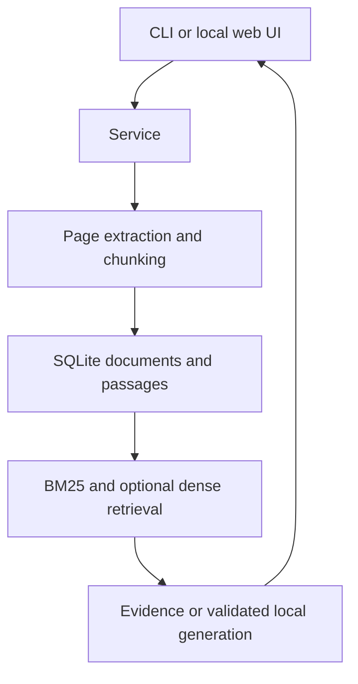

# Atlas

**Document intelligence with evidence you can inspect.**

Atlas ingests contracts, policies, and reports, retrieves relevant passages, and returns their original document and page references. Start in an offline evidence mode; optionally add dense semantic retrieval and a local Ollama model for cited synthesis.

This is a working portfolio MVP with a local web interface, CLI, JSON API, SQLite persistence, reproducible toy evaluations, and CI. It is not a production legal research service.

## Quick start

Requires Python 3.11+. The default text/Markdown demo has **no third-party dependencies**.

```bash
git clone https://github.com/daimich/atlas-docs.git
cd atlas-docs
python -m atlas ingest examples/documents
python -m atlas serve
```

Open **http://127.0.0.1:8080**. Upload a document or ask “How much notice is required for termination?”

If you downloaded the source archive, extract it and start at `cd atlas-docs`; cloning requires the remote repository to exist.

```bash
python -m atlas ask "What is the liability limit?"
python -m atlas list
python -m atlas eval
python -m unittest discover -s tests -v
```

For an installed CLI, run `python -m pip install .`, then use `atlas` in place of `python -m atlas`. Windows users may use `py` in place of `python`.

## What works

| Capability | Implementation |
|---|---|
| Ingestion | UTF-8 text/Markdown; optional text-based PDF extraction |
| Provenance | SHA-256 document IDs; immutable document/page/chunk references |
| Chunking | 160-word chunks, 32-word overlap; no chunks cross PDF pages |
| Retrieval | BM25 by default; optional dense cosine search fused with reciprocal rank fusion |
| Answers | Original retrieved passages by default; optional locally generated cited claims |
| Citation checks | Unknown citation IDs and nonmatching quotes are rejected |
| Persistence | Transactional SQLite ingestion, content deduplication, cascading deletion |
| Interface | Local web workspace, CLI, and JSON endpoints |
| Evaluation | Recall@5 and MRR@5 on six fictional document queries |

## Optional semantic retrieval

```bash
python -m pip install '.[semantic]'
python -m atlas --semantic-model sentence-transformers/all-MiniLM-L6-v2 ask "When can either side end the contract?"
python -m atlas --semantic-model sentence-transformers/all-MiniLM-L6-v2 serve
```

The first model load may download weights. You can instead pass an already downloaded local model directory. The default BM25 mode does not use embeddings. Similarity thresholds are heuristic, not calibrated confidence scores.

## Optional PDF support

```bash
python -m pip install '.[pdf]'
python -m atlas ingest /path/to/report.pdf
```

Encrypted PDFs and documents over 15 MiB or 2,000 pages are rejected. Scanned documents need external OCR; extraction alone cannot read images. Text/Markdown files use page 1 as their citation anchor.

## Optional local generation

Install Ollama separately and pull a model you can run on your machine, for example:

```bash
ollama pull llama3.2
python -m atlas --ollama-model llama3.2 ask "What are the payment terms?"
python -m atlas --ollama-model llama3.2 serve
```

The adapter requests JSON claims, then checks that every cited ID exists and every quote occurs verbatim in that passage. **Quote validity does not prove the claim is supported by the quote.** Prompt injection, wrong synthesis, and insufficient context remain possible; inspect the original evidence. Invalid responses fail visibly instead of silently becoming uncited answers.

## Architecture



See [architecture and tradeoffs](docs/architecture.md), [API examples](docs/api.md), and [development roadmap](docs/roadmap.md).

## Docker demo

```bash
docker build -t atlas-docs .
docker run --rm -p 127.0.0.1:8080:8080 atlas-docs
```

The container starts with fictional text documents. Its index is ephemeral unless you mount a persistent directory and pass `--db`. The Docker build and real model downloads have not been validated in the initial development environment.

## Evaluation and validation

Run ingestion before `eval`, ideally with a fresh index containing only the demo corpus. Results describe a tiny synthetic dataset, not real legal or financial accuracy. No large-corpus or latency claims are made. The test suite covers duplicate ingestion, page-aware chunking, cache invalidation, citation rejection, adapter contracts, retrieval, and HTTP origin validation. Semantic/model adapters are tested with mocks; end-to-end model quality still needs evaluation.

## Operating limits

The HTTP server binds to loopback by default and accepts only localhost Host/Origin values. It has no authentication, tenancy, TLS, asynchronous ingestion, or rate limiting. The corpus and dense vectors are loaded into process memory; BM25 scans all chunks per query. Keep it local and small. Configure a production API gateway and access controls before remote use.

MIT licensed. Example documents are fictional and contain no real customer data.
